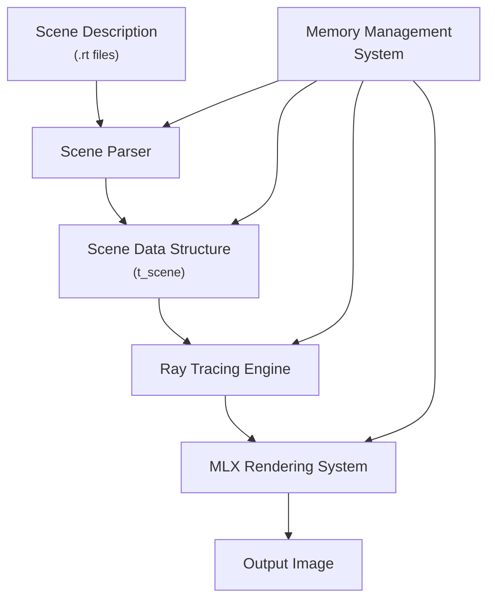
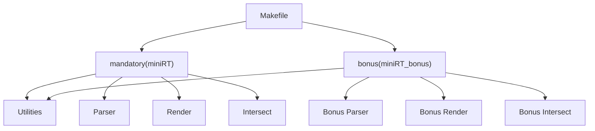
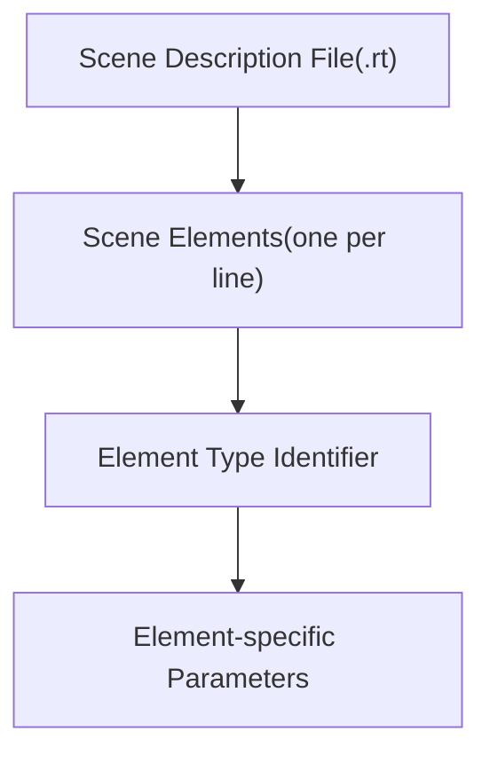
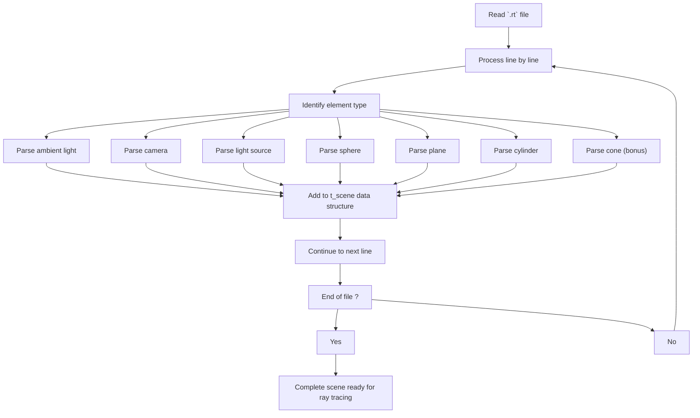
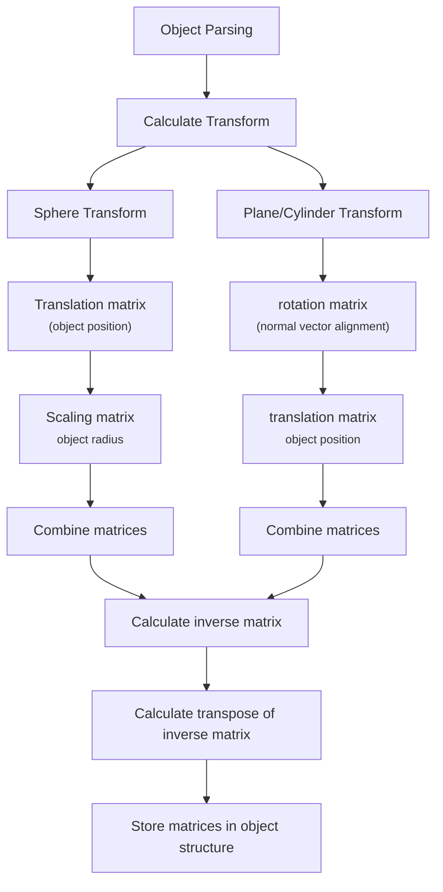

# MiniRT - A Minimal Ray Tracer in C

MiniRT is a C-based ray tracing engine that renders 3D scenes from custom configuration files. It includes both mandatory (basic) and bonus (advanced) implementations.

## Table of Contents
- [Overview](#Overview)
- [Scene Description Format](#Scene-Description-Format)
- [Object Structures and Representation](#Object-Structures-and-Representation)
- [Guide](#Guide)
- [Primitive Types](#primitive-types)
- [Memory Management](#memory-management)
- [Build System](#build-system)
- [Installation](#installation)
- [Usage](#usage)
- [Scene File Format](#scene-file-format)
- [Controls](#controls)
- [Examples](#examples)
- [Contributing](#contributing)
- [License](#license)

## Overview
This document provides a high-level overview of MiniRT, a ray tracing engine implemented in C that renders 3D scenes described in a custom .rt file format. For specific details about the scene file format, see [-^- System Architecture](#system-architecture).

### -^- What is MiniRT?
MiniRT is a ray tracing renderer that simulates light physics to generate realistic images of 3D scenes. The project includes both a mandatory implementation with basic features and a bonus implementation that adds advanced capabilities such as textures, bump mapping, and additional primitive types.

### -^- System Architecture

##### Each component has a specific responsibility:
    - Scene Parser: Reads `.rt` files and creates scene objects
    - Scene Data Structure: Central data repository for all scene information  
    - Ray Tracing Engine: Performs ray-object intersections and lighting calculations
    - MLX Rendering System: Displays the final rendered image
    - Memory Management: Handles allocation and cleanup of resources

### -^- Ray Tracing Pipeline
##### The core rendering process follows this pipeline:
    1. Generates a ray from the camera through the pixel
    2. Tests for intersections with all objects in the scene
    3. Determines the closest intersection point
    4. Calculates the surface normal at the intersection point
    5. Tests if the point is in shadow
    6. Calculates lighting based on materials and light sources
    7. Determines the final pixel color
    8. Renders the pixel to the output image

### -^- Supported Primitive Types
##### MiniRT supports several geometric primitives:

| Primitive  | Mandatory | Bonus | Description                          |
|------------|-----------|-------|--------------------------------------|
| Sphere     | ✓         | ✓     | Simple sphere defined by center position and radius        |
| Plane      | ✓         | ✓     | Infinite plane defined by point and normal vector |
| Cylinder   | ✓         | ✓     | Cylinder defined by center, axis, radius, and height  |
| Cone       | ✗         | ✓     | Cone defined by center, axis, radius, and height        |

##### The bonus implementation also supports advanced surface features:
    - Texture mapping (using XPM files)
    - Checkerboard patterns
    - Bump mapping

### -^- Build System
##### MiniRT uses a Makefile to manage compilation of both the mandatory and bonus implementations:

### -^- Usage
##### MiniRT is invoked from the command line with a scene file as its only argument:
    `./miniRT scene_file.rt`
##### or for the bonus version:
    `./miniRT_bonus scene_file.rt`
The program will render the scene and display it in a window.

## Scene Description Format
### -^- File Format Overview
MiniRT uses text-based .rt files to define complete 3D scenes. Each line in the file represents a single scene element, with the first identifier determining the type of element.

### -^- Element Types and Syntax
##### The .rt file format supports the following element types:

| Identifier | Element Type | Required | Description |
| ---------- | ------------ | -------- | ----------- |
| A          | Ambient Light | Yes(1) | Global ambient lighting for the scene |
| C          | Camera | Yes(1) | Viewpoint for rendering the scene |
| L or l     | Light | Yes(>= 1) | Point light source |
| sp         | Sphere | No | Spherical geometric primitive |
| pl         | plane | NO | Infinite plane geometric primitive |
| cy         | Cylinder | No | Cylindrical geometric primitive |
| co         | Cone | No (Bonus) | Conical geometric primitive |

### -^- Scene Configuration Elements
**Ambient Light(A)**
##### Defines the global ambient lighting for the entire scene.
`Syntax: A intensity color`

| Parameter | Type | Description |
| --------- | ---- | ----------- |
| Intensity | Float (0.0-1.0) | Brightness of the ambient light |
| color | r.g.b (0-255) | RGB color values of the ambient light |

`Example: A 0.1 50,50,50`

**Camera(C)**
##### Defines the viewpoint from which the scene is rendered.
`Syntax: C position orientation fov`

| Parameter | Type | Description |
| --------- | ---- | ----------- |
| position | x,y,z | 3D coordinates of the camera position |
| orientation | x,y,z | Normalized vector (-1 to 1) indicating camera direction |
| fov | Integer | Field of view in degrees (typically 0-180) |

`Example: C 0,0,-10 0,0,1.0 60`

**Light Source(L/l)**
##### Defines a point light source in the scene.
`Syntax: L/l position bghitness color`

| Parameter | Type | Description |
| --------- | ---- | ----------- |
| position | x,y,z | 3D coordinates of the light source |
| bghitness | Float (0.0-1.0) | Intensity of the light source |
| color | r,g,b (0-255) | RGB color values of the light |

`Example: L/l -10,10,-10 1 255,255,255`

**Sphere(sp)**
##### Defines a sphere in the scene.
`Syntax: sp position diameter color [checker size checker_color] [texture=path]`

| Parameter | Type | Description |
| --------- | ---- | ----------- |
| position | x,y,z | 3D coordinates of the sphere's center |
| diameter | Float | Diameter of the sphere |
| color | r,g,b (0-255) | RGB color values of the sphere |

- checker and textures are optional

`Example: sp 0,0,0 4 255,51,255`

**Plane(pl)**
##### Defines an infinite plane in the scene.
`Syntax: pl position normal color [checker size checker_color] [texture=path]`

| Parameter | Type | Description |
| --------- | ---- | ----------- |
| position | x,y,z | 3D coordinates of a point on the plane |
| normal | x,y,z | Normalized vector perpendicular to the plane |
| color | r,g,b (0-255) | RGB color values of the plane |

- checker and textures are optional

`Example: pl 0,0,0 0,-1,0 255,200,40`

**Cylinder(cy)**
##### Defines a cylinder in the scene.
`Syntax: cy position axis radius height color [checker size checker_color]`

| Parameter | Type | Description |
| --------- | ---- | ----------- |
| position | x,y,z | 3D coordinates of the center of cylinder's base |
| axis | x,y,z | Normalized vector indicating cylinder orientation |
| radius | Float | Radius of the cylinder |
| height | Float | Height of the cylinder |
| color | r,g,b (0-255) | RGB color values of the cylinder |

- checker and textures are optional

`Example: cy 2,0,0 0,1,0 2 4 100,200,100`

**Cone(co)-Bonus Feature**
##### Defines a cone in the scene (only available in the bonus implementation).
`Syntax: co position axis radius height color [checker size checker_color] [texture=path]`

| Parameter | Type | Description |
| --------- | ---- | ----------- |
| position | x,y,z | 3D coordinates of the center of cone's base |
| axis | x,y,z | Normalized vector indicating cone orientation |
| radius | Float | Radius of the cone's base |
| height | Float | Height of the cone |
| color | r,g,b (0-255) | RGB color values of the cone |

- checker and textures are optional

`Example: co 10,10,-5 1,-1,0 4 10 0,51,255`

### -^- Parsing Process

## Object Structures and Representation
##### Each object type in MiniRT has its own data structure to store its properties.
### Camera Representation
The camera defines the viewpoint from which the scene is rendered.
When a camera is parsed, a view transformation matrix is calculated based on its position and orientation. This matrix is then inverted to transform rays from the camera space into world space.

### Light and Ambient Light Representation
Lights are essential for illumination calculation in the ray tracer.
The ambient light provides a base level of illumination for all objects, while point lights create directional lighting effects.

### Geometric Objects Representation
###### Each geometric object maintains:
    - Position information
    - Shape-specific parameters (radius, normal vector, etc.)
    - Color information
    - Transformation matrices for ray intersection calculations
    - A pointer to the next object of the same type (linked list)

### Transformation Calculation
##### A key aspect of object representation is the calculation of transformation matrices, which are used to simplify intersection calculations.

### Transformation Purpose
##### The transformation matrices serve several key purposes:
    1. They allow complex intersection calculations to be performed in a simplified object space
    2. They enable calculation of surface normals which are essential for lighting and reflection
    3. They maintain the orientation and scale of objects relative to the world coordinate system

## Guide
[Ray tracing challenge](https://api.pageplace.de/preview/DT0400.9781680506792_A37437237/preview-9781680506792_A37437237.pdf)

##### ray sphere intersection
[ray sphere intersection](https://www.scratchapixel.com/lessons/3d-basic-rendering/minimal-ray-tracer-rendering-simple-shapes/ray-sphere-intersection.html)

##### ray plane intersection
[ray plane intersection](https://www.scratchapixel.com/lessons/3d-basic-rendering/minimal-ray-tracer-rendering-simple-shapes/ray-plane-and-ray-disk-intersection.html)

##### ray cylinder intersection
[ray cylinder intersection](https://mrl.cs.nyu.edu/~dzorin/rendering/lectures/lecture3/lecture3.pdf)

