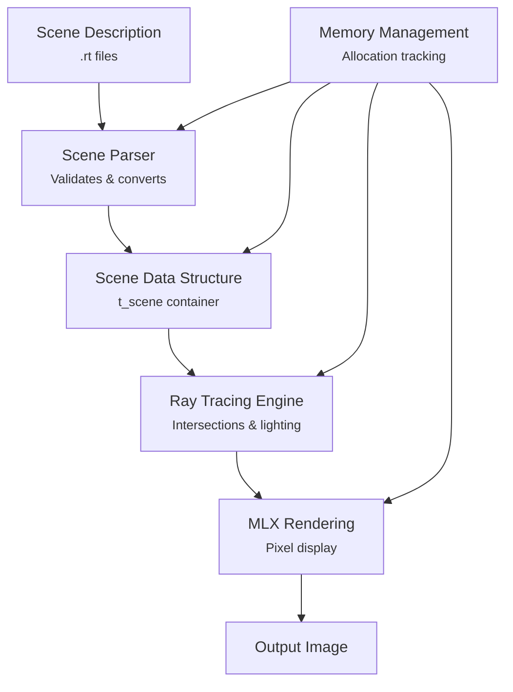

# MiniRT - A Minimal Ray Tracer in C

MiniRT is a C-based ray tracing engine that renders 3D scenes from custom configuration files. It includes both mandatory (basic) and bonus (advanced) implementations.

## Table of Contents
- [Overview](#Overview)
- [System Architecture](#system-architecture)
- [Ray Tracing Pipeline](#ray-tracing-pipeline)
- [Core Data Structures](#core-data-structures)
- [Primitive Types](#primitive-types)
- [Memory Management](#memory-management)
- [Build System](#build-system)
- [Installation](#installation)
- [Usage](#usage)
- [Scene File Format](#scene-file-format)
- [Controls](#controls)
- [Examples](#examples)
- [Contributing](#contributing)
- [License](#license)

### Overview
This document provides a high-level overview of MiniRT, a ray tracing engine implemented in C that renders 3D scenes described in a custom .rt file format. For specific details about the scene file format, see [System Architecture](#system-architecture).

#### What is MiniRT?
MiniRT is a ray tracing renderer that simulates light physics to generate realistic images of 3D scenes. The project includes both a mandatory implementation with basic features and a bonus implementation that adds advanced capabilities such as textures, bump mapping, and additional primitive types.

#### System Architecture

| Primitive  | Mandatory | Bonus | Description                          |
|------------|-----------|-------|--------------------------------------|
| Sphere     | ✓         | ✓     | Defined by center and radius         |
| Plane      | ✓         | ✓     | Infinite plane with point and normal |
| Cylinder   | ✓         | ✓     | Defined by center, axis, dimensions  |
| Cone       | ✗         | ✓     | Circular cone with apex angle        |
