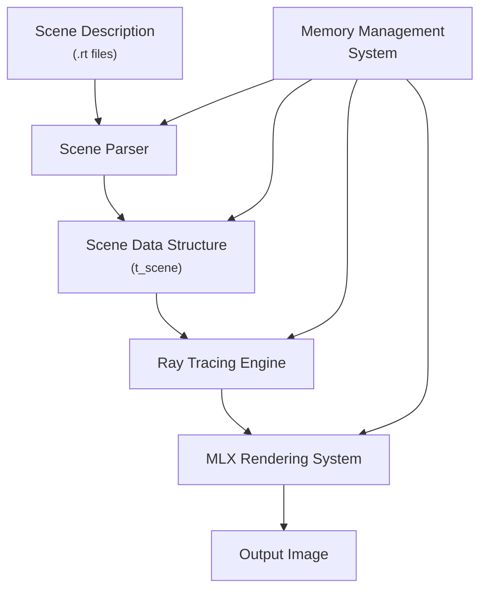
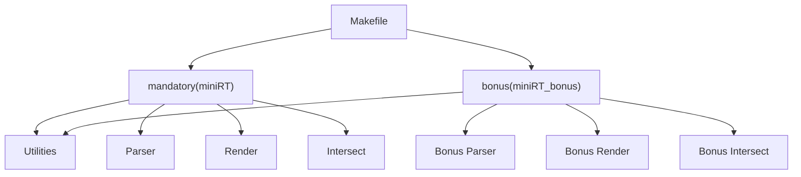
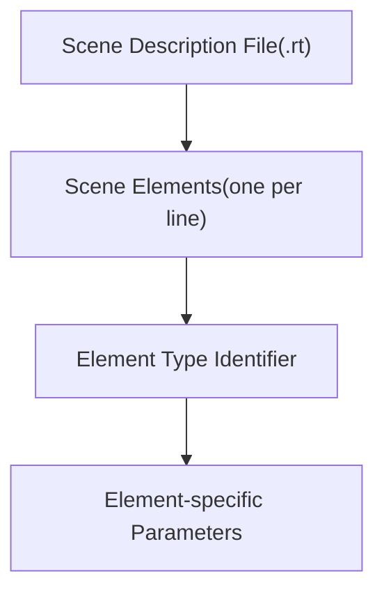

# MiniRT - A Minimal Ray Tracer in C

MiniRT is a C-based ray tracing engine that renders 3D scenes from custom configuration files. It includes both mandatory (basic) and bonus (advanced) implementations.

## Table of Contents
- [Overview](#Overview)
- [Scene Description Format](#Scene-Description-Format)
- [Ray Tracing Pipeline](#ray-tracing-pipeline)
- [Core Data Structures](#core-data-structures)
- [Primitive Types](#primitive-types)
- [Memory Management](#memory-management)
- [Build System](#build-system)
- [Installation](#installation)
- [Usage](#usage)
- [Scene File Format](#scene-file-format)
- [Controls](#controls)
- [Examples](#examples)
- [Contributing](#contributing)
- [License](#license)

## Overview
This document provides a high-level overview of MiniRT, a ray tracing engine implemented in C that renders 3D scenes described in a custom .rt file format. For specific details about the scene file format, see [System Architecture](#system-architecture).

### -^- What is MiniRT?
MiniRT is a ray tracing renderer that simulates light physics to generate realistic images of 3D scenes. The project includes both a mandatory implementation with basic features and a bonus implementation that adds advanced capabilities such as textures, bump mapping, and additional primitive types.

### -^- System Architecture

##### Each component has a specific responsibility:
    - Scene Parser: Reads `.rt` files and creates scene objects
    - Scene Data Structure: Central data repository for all scene information  
    - Ray Tracing Engine: Performs ray-object intersections and lighting calculations
    - MLX Rendering System: Displays the final rendered image
    - Memory Management: Handles allocation and cleanup of resources

### -^- Ray Tracing Pipeline
##### The core rendering process follows this pipeline:
    1. Generates a ray from the camera through the pixel
    2. Tests for intersections with all objects in the scene
    3. Determines the closest intersection point
    4. Calculates the surface normal at the intersection point
    5. Tests if the point is in shadow
    6. Calculates lighting based on materials and light sources
    7. Determines the final pixel color
    8. Renders the pixel to the output image

### -^- Supported Primitive Types
##### MiniRT supports several geometric primitives:

| Primitive  | Mandatory | Bonus | Description                          |
|------------|-----------|-------|--------------------------------------|
| Sphere     | ✓         | ✓     | Simple sphere defined by center position and radius        |
| Plane      | ✓         | ✓     | Infinite plane defined by point and normal vector |
| Cylinder   | ✓         | ✓     | Cylinder defined by center, axis, radius, and height  |
| Cone       | ✗         | ✓     | Cone defined by center, axis, radius, and height        |

##### The bonus implementation also supports advanced surface features:
    - Texture mapping (using XPM files)
    - Checkerboard patterns
    - Bump mapping

### -^- Build System
##### MiniRT uses a Makefile to manage compilation of both the mandatory and bonus implementations:

### -^- Usage
##### MiniRT is invoked from the command line with a scene file as its only argument:
    `./miniRT scene_file.rt`
##### or for the bonus version:
    `./miniRT_bonus scene_file.rt`
The program will render the scene and display it in a window.

## Scene Description Format
### -^- File Format Overview
MiniRT uses text-based .rt files to define complete 3D scenes. Each line in the file represents a single scene element, with the first identifier determining the type of element.

### -^- Element Types and Syntax
##### The .rt file format supports the following element types:

| Identifier | Element Type | Required | Description |
| ---------- | ------------ | -------- | ----------- |
| A          | Ambient Light | Yes(1) | Global ambient lighting for the scene |
| C          | Camera | Yes(1) | Viewpoint for rendering the scene |
| L or l     | Light | Yes(>= 1) | Point light source |
| sp         | Sphere | No | Spherical geometric primitive |
| pl         | plane | NO | Infinite plane geometric primitive |
| cy         | Cylinder | No | Cylindrical geometric primitive |
| co         | Cone | No (Bonus) | Conical geometric primitive |

### -^- Scene Configuration Elements
##### Ambient Light(A)
Defines the global ambient lighting for the entire scene.
**Syntax:** `A intensity color`

